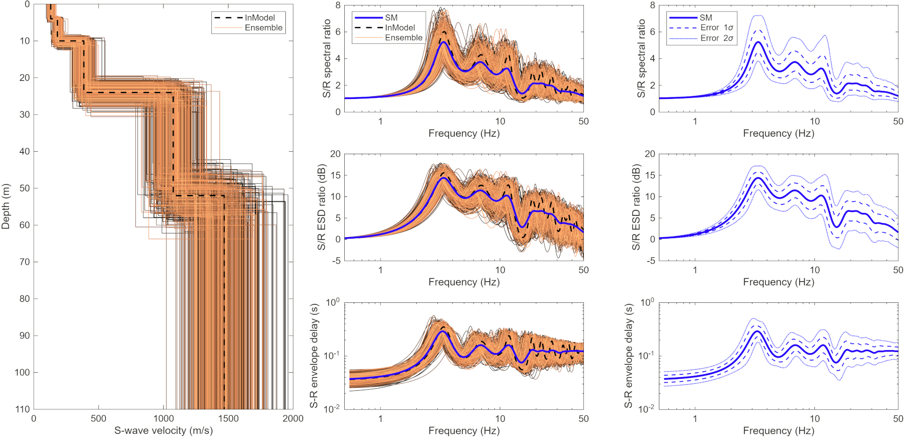

# Stochastic model for site-specific amplification
Tools suite for characterizing seismic ground motion amplification 
between ground surface and reference points (depth or rock outcrop)
including stochastic perturbations of local 1D velocity models.
***************************************

This repository provides a comprehensive tools suite for the computation 
of a **Stochastic Model (SM)** designed to quantify ground motion 
amplification. The methodology accounts for uncertainties in subsurface 
properties by utilizing randomly perturbed 1D velocity models. The 
amplification is evaluated in the spectral domain and characterized by 1) 
S/B Spectral Ratio (Amplification), 2) Energy Spectral Density Ratio
(expressed in dB), and 3) Envelope Delay (seconds).

**Applications:**
*   **Seismic Hazard Assessment:** Site-specific characterization for urban areas and critical infrastructure.
*   **Nuclear Safety:** Ground motion prediction for deep geological repositories (nuclear waste storage).
*   **Catastrophe Modeling:** Quantification of site effects and spectral amplification for risk assessment.
*   **Waveform Prediction:** Full-waveform broadband predictions at various depths.

1 METHODOLOGY
===================

The core of the toolset is based on the computation of 1D transfer functions. By incorporating 
stochastic perturbations of seismic velocities and layer thicknesses, the model provides a 
probabilistic view of site response, moving beyond simple deterministic estimates to full 
Uncertainty Quantification.

  Hallo, M., Bergamo, P., Fäh, D. (2022). Stochastic model to characterize 
high-frequency ground motion at depth validated by KiK-net vertical array data,
Bulletin of the Seismological Society of America, 112 (4), 1997–2017. [https://doi.org/10.1785/0120220038](https://doi.org/10.1785/0120220038)

  Hallo, M., Imtiaz, A., Koroni, M., Perron, V., Fäh, D. (2023). Characterization 
and modeling of ground motion at depth in soft sedimentary rocks: Application to 
the Swiss Molasse Basin, Soil Dynamics and Earthquake Engineering, 173:108089. 
[https://doi.org/10.1016/j.soildyn.2023.108089](https://doi.org/10.1016/j.soildyn.2023.108089)
  
  Hallo, M., Bergamo, P., Fäh, D. (2024). Multipath transfer-function correction 
method to predict site-specific amplification at city scale, Seismological Research Letters, 
95 (1), 172-185. [https://doi.org/10.1785/0220230213](https://doi.org/10.1785/0220230213)

2 TECHNICAL IMPLEMENTATION
===================

Cross-Platform (Windows, Linux), Stochastic Modeling, Generates formatted output text files

The official software version is archived on Zenodo:

3 PACKAGE CONTENT
===================

  1. `sm.m` - Subroutine for computation of the Stochastic Model (SM)
  2. `respSH.m` - Subroutine for computation of the Transfer Function
  3. `example.m` - Example to run the SM subroutine

4 REQUIREMENTS
===================

  MATLAB: Tested on version R2018b, R2025b, Codes do not require any additional Matlab Toolboxes.

5 USAGE
===================

  1. Open MATLAB
  2. Run the main scripts: `example.m`
  3. Check resultant figures `example_output_1.png`, `example_output_2.png`, `example_output_3.png` and text file `example_output.dat`

6 EXAMPLE OUTPUT
===================

This repository provides routines for evaluating the Stochastic Model (SM). The included example is for illustrative purposes; for full functionality, users should integrate these subroutines into their own projects. The figures below demonstrate a test case using a generic 1D velocity profile. They show the **perturbed 1D velocity models**, the **surface-to-outcrop transfer functions**, and the resultant **Stochastic Model (SM)** with uncertainty quantification (1σ).

<picture>
  <source media="(prefers-color-scheme: dark)" srcset="img/SM_dark.png">
  <source media="(prefers-color-scheme: light)" srcset="img/SM_light.png">
  
</picture>

7 COPYRIGHT
===================

Copyright (C) 2020-2023 Swiss Seismological Service, ETH Zurich

This program is published under the GNU General Public License (GNU GPL).

This program is free software: you can modify it and/or redistribute it
or any derivative version under the terms of the GNU General Public
License as published by the Free Software Foundation, either version 3
of the License, or (at your option) any later version.

This code is distributed in the hope that it will be useful, but WITHOUT
ANY WARRANTY. We would like to kindly ask you to acknowledge the authors
and don't remove their names from the code.

You should have received copy of the GNU General Public License along
with this program. If not, see <http://www.gnu.org/licenses/>.
